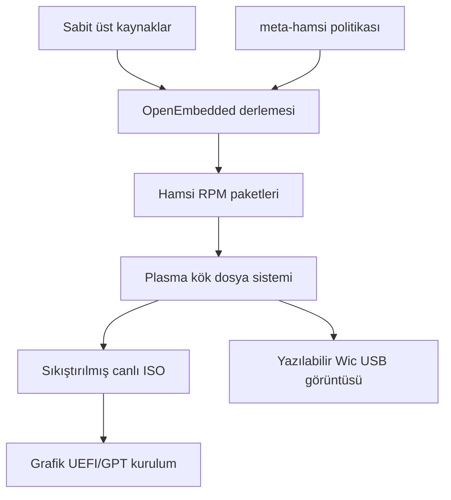

# Hamsi Linux mimarisi

Hamsi Linux'un bağımsızlığı, var olan bir dağıtımın paket deposunu veya kök
dosya sistemini kullanmamasından gelir. OpenEmbedded tarifleri kaynakları alır,
Hamsi politikasıyla derler ve RPM paketlerinden yeni bir kök dosya sistemi
oluşturur. Linux, Qt ve KDE gibi üst projeler yeniden yazılmaz; sabit ve
denetlenebilir girdiler olarak kullanılır.

## Katmanlar

| Bileşen | Sorumluluk |
|---|---|
| BitBake 2.16 | Tarif görev grafiği ve yeniden üretilebilir yürütme |
| OpenEmbedded Core / wrynose | libc, systemd, araç zinciri ve temel tarifler |
| meta-openembedded | ağ, medya, dosya sistemi ve masaüstü ek tarifleri |
| meta-qt6 6.11 | Qt 6 çalışma zamanı ve araçları |
| KDE meta-kf6 / meta-kde | Plasma 6, Frameworks ve KDE uygulamaları |
| meta-hamsi | Dağıtım politikası, çekirdek parçası, görüntü, kurucu ve marka |

## Önyükleme

ISO, Yocto `image-live` altyapısının UEFI El Torito girdisini ve sıkıştırılmış
SquashFS kökünü kullanır. Canlı kök salt okunurdur. Kurucu seçilen diskte 512
MiB FAT32 EFI Sistem Bölümü ve kalan alanı kullanan ext4 kök bölümü oluşturur,
dosya sistemini kopyalar ve systemd-boot girdisini yazar. Wic çıktısı aynı
tabanın geliştirici amaçlı doğrudan yazılabilir biçimidir.

## Güvenlik sınırları

- Root hesabı kilitlidir.
- Canlı kullanıcıya verilen parolasız sudo dosyası kurulu sisteme taşınmaz.
- Kurucu çalışan sistem diskini listeden çıkarır ve `SİL` yazılı onayı ister.
- nftables/firewalld, polkit, seccomp, çekirdek lockdown ve TPM desteği açıktır.
- Kaynaklar SHA-1 commit'lerine, ikili uygulamalar SHA-256 özetlerine bağlıdır.
- Her tam derleme SPDX 3.0 bileşen dökümü üretir.

## Güncelleme modeli

İlk sürümde kullanıcı uygulamaları Flatpak/Flathub üzerinden, sistem paketleri
ise üretilen RPM kümesi üzerinden yönetilir. Genel bir Hamsi RPM sunucusu
yayımlanana kadar çekirdek ve temel sistem güncellemeleri yeni doğrulanmış ISO
sürümleriyle yapılır. Depo bir güncelleme sunucusu varmış gibi davranmaz.
